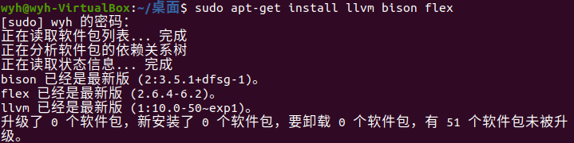
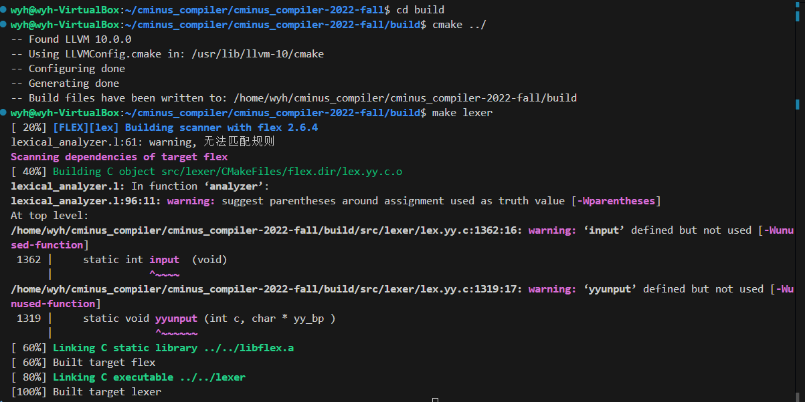
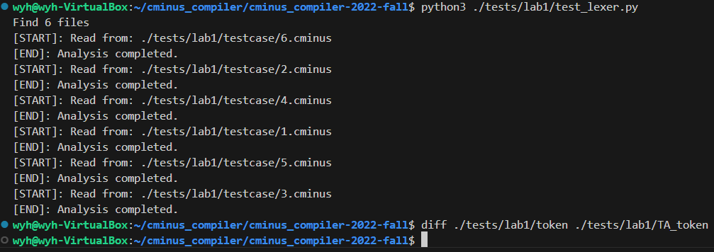

# lab1实验报告

**学号：202308010412**  
**姓名：王宇航**

## 一、实验要求

本次实验需要根据`cminux-f`的词法补全[lexical_analyer.l](../../src/lexer/lexical_analyzer.l)文件，完成词法分析器，能够输出识别出的`token`，`type` ,`line(刚出现的行数)`，`pos_start(该行开始位置)`，`pos_end(结束的位置,不包含)`。如：

文本输入：

```c
 int a;
```

则识别结果应为：

```shell
int     280     1       2       5
a       285     1       6       7
;       270     1       7       8
```
**具体的需识别token参考[lexical_analyzer.h](../../include/lexical_analyzer.h)**

**特别说明对于部分token，我们只需要进行过滤，即只需被识别，但是不应该被输出到分析结果中。因为这些token对程序运行不起到任何作用。**

> 注意，修改的文件应仅有[lexical_analyer.l](../../src/lexer/lexical_analyzer.l)。关于`FLEX`用法上文已经进行简短的介绍，更高阶的用法请参考百度、谷歌和官方说明。

## 二、实验难点
### 1. 环境配置
**实验环境：Ubuntu 20.04**   

**Tips** .安装LLVM可以直接在Linux下命令行输入  

`sudo apt-get install llvm bison flex`



安装完成后可以输入

`flex --version`

`bison --version`

查看版本

### 2. FLEX 基础用法
什么是flex？  
* flex是指 fast lexical analyzer generator,快速词法分析器生成器，也就是说，flex用于产生词法分析器；

  - flex的输入是文件或输入设备，这些输入中的信息以正则表达式和C代码的形式组成，这些形式被称为规则（rule）；
  - flex的默认输出是C语言的源码文件：lex.yy.c，也可以重命名；该文件通过编译生成可执行的文件；  
  
* 当可执行文件被执行时，其分析输入中可能存在的符合规则的内容，当找到任何一个正则表达式相匹配内容时，相应的C代码将被执行；

flex的输入文件由3段组成，用一行中只有%%来分隔；  
```bash
定义:definition
%%
规则:rules
%%
用户代码:code
```
### 3.git 基础用法
**1. 获取项目到本地的工作目录**  

```bash
htps://gitee.com/你的gitee用户名/cminus_compiler-2021-fall.git
```

“你的gitee用户名”是打开个人主页，昵称下面有个“@……”，用户名就是@后面的一串字符；或者打开仓库，在最上边的https://gitee.com……也可以看到。

**2.将工作上传至git仓库**

打开本地的工作目录，在命令行中输入

```bash
git add *

git commit -m "注释语句"
```

**3. 然后push到仓库**

`git push`


## 三、实验设计
### 1. token定义
```c
typedef enum cminus_token_type {
    //运算
    ADD = 259,
    SUB = 260,
    MUL = 261,
    DIV = 262,
    LT = 263,
    LTE = 264,
    GT = 265,
    GTE = 266,
    EQ = 267,
    NEQ = 268,
    ASSIN = 269,
    //符号
    SEMICOLON = 270,
    COMMA = 271,
    LPARENTHESE = 272,
    RPARENTHESE = 273,
    LBRACKET = 274,
    RBRACKET = 275,
    LBRACE = 276,
    RBRACE = 277,
    //关键字
    ELSE = 278,
    IF = 279,
    INT = 280,
    FLOAT = 281,
    RETURN = 282,
    VOID = 283,
    WHILE = 284,
    //ID和NUM
    IDENTIFIER = 285,
    INTEGER = 286,
    FLOATPOINT = 287,
    ARRAY = 288,
    LETTER = 289,
    //others
    EOL = 290,
    COMMENT = 291,
    BLANK = 292,
    ERROR = 258

} Token;
```

**这是 C-Minus 编译器的词法分析阶段使用的令牌类型定义，用于：**

- **Flex/Lex 词法分析器返回令牌类型**

- **语法分析器识别不同的语法元素**

- **错误处理和语法检查**

### 2. token对应的正则表达式
```c
 /******** 运算 ********/
\+   {pos_start = pos_end; pos_end++; return ADD;}
\-   {pos_start = pos_end; pos_end++; return SUB;}
\*   {pos_start = pos_end; pos_end++; return MUL;}
\/   {pos_start = pos_end; pos_end++; return DIV;}
\<   {pos_start = pos_end; pos_end++; return LT;}
"<=" {pos_start = pos_end; pos_end+=2; return LTE;}
\>   {pos_start = pos_end; pos_end++; return GT;}
">=" {pos_start = pos_end; pos_end+=2; return GTE;}
"==" {pos_start = pos_end; pos_end+=2; return EQ;}  
"!=" {pos_start = pos_end; pos_end+=2; return NEQ;}
\=   {pos_start = pos_end; pos_end++; return ASSIN;}
​
/******** 符号 ********/
\;   {pos_start = pos_end; pos_end++; return SEMICOLON;}
\,   {pos_start = pos_end; pos_end++; return COMMA;}
\(  {pos_start = pos_end; pos_end++; return LPARENTHESE;}
\)  {pos_start = pos_end; pos_end++; return RPARENTHESE;}
\[  {pos_start = pos_end; pos_end++; return LBRACKET;}
\]  {pos_start = pos_end; pos_end++; return RBRACKET;}
\{  {pos_start = pos_end; pos_end++; return LBRACE;}
\}  {pos_start = pos_end; pos_end++; return RBRACE;}
​
 /******** 关键字 ********/
else {pos_start = pos_end; pos_end+=4; return ELSE;}
if   {pos_start = pos_end; pos_end+=2; return IF;}
int  {pos_start = pos_end; pos_end+=3; return INT;}
float {pos_start = pos_end; pos_end+=5; return FLOAT;}
return {pos_start = pos_end; pos_end+=6; return RETURN;}
void   {pos_start = pos_end; pos_end+=4; return VOID;}
while  {pos_start = pos_end; pos_end+=5; return WHILE;}
​
/******** ID和NUM ********/
[a-zA-Z]+ {pos_start = pos_end; pos_end+=strlen(yytext); return IDENTIFIER;}
[a-zA-Z]  {pos_start = pos_end; pos_end++; return LETTER;}  
[0-9]+    {pos_start = pos_end; pos_end+=strlen(yytext); return INTEGER;}
[0-9]+\.|[0-9]*\.[0-9]+{pos_start=pos_end;pos_end+=strlen(yytext);return FLOATPOINT;}
"[]"      {pos_start = pos_end; pos_end+=2; return ARRAY;}
​
/******** others ********/
\n  {return EOL;} 
"/*"([^*]|\*+[^*/])*\*+"/"  {return COMMENT;}
[" "|\t] {pos_start = pos_end; pos_end+=strlen(yytext);return BLANK;}
. {return ERROR;}
```

### 3. 补全辅助函数
```c
while(token = yylex()){
        switch(token){
            case COMMENT: //注释
        len = strlen(yytext);
        for(int i=0;i<len;i++){//循环判断注释中是否存在换行符
           if(yytext[i]=='\n') {//yytext[i]是换行\n
               lines++;{    //则将lines加1；
               pos_end = 1; //将pos_start和pos_end设置为1
            }
            else pos_end++;  //否则pos_end++;
           }
            break;  //当循环结束则break;
  case BLANK:
         break;
  case EOL:
         lines++;
         pos_end = 1;
         break;
```
**这段代码是词法分析器的词法单元处理循环，主要功能是：**
1. **注释处理 (COMMENT)**    
**功能：统计注释中的换行符数量，更新行号和位置计数器。**
1. **空白符处理 (BLANK)**

2. **行结束符处理 (EOL)**

3. **核心变量作用**
- token：当前读取的词法单元类型

- yytext：当前此法单元对应的文本内容

- lines：行号计数器，遇到换行符时递增

- pos_end：位置计数器，记录当前行内的字符位置
## 四、实验结果验证

### 1. 编译运行

**通过下列指令进行编译运行**
* 编译

  ```shell
  # 进入workspace
  $ cd cminus_compiler-2022-fall
  
  # 创建build文件夹，配置编译环境
  $ mkdir build 
  $ cd build 
  $ cmake ../
  
  # 开始编译
  # 如果你只需要编译lab 1，请使用 make lexer
  $ make
  ```

  编译成功将在`${WORKSPACE}/build/`下生成`lexer`命令

* 运行

  ```shell
  $ cd cminus_compiler-2022-fall
  # 运行lexer命令
  $ ./build/lexer
  usage: lexer input_file output_file
  ```
* 个人编译运行结果：



### 2. 助教测试案例
我们提供了`./tests/lab1/test_lexer.py` python脚本用于调用`lexer`批量完成分析任务。

  ```shell
  # test_lexer.py脚本将自动分析./tests/lab1/testcase下所有文件后缀为.cminus的文件，并将输出结果保存在./tests/lab1/token文件下下
  $ python3 ./tests/lab1/test_lexer.py
  	···
  	···
  	···
  #上诉指令将在./tests/lab1/token文件夹下产生对应的分析结果
  $ ls ./tests/lab1/token
  1.tokens  2.tokens  3.tokens  4.tokens  5.tokens  6.tokens
  ```

**运行Python脚本并对比结果：**  


由结果可见，可成功生成token文件，且在对比助教提供的正确版本后发现结果相同

### 3. 个人测试案例
* 注释测试  
测试代码如下：
```c
/* 这是一个单行注释 */
int main() {
    return 0;
}

/* 这是一个
   多行
   注释 */

/* 嵌套/*是不允许的*/但这里会怎么处理？*/

// 这不是C-Minus风格的注释
```
***
**预期结果：**
* 单行注释处理  
  * 第一行注释：被正确识别为COMMENT token，整行内容被忽略

  * 位置计算：注释结束后，位置计数器正确重置到下一行开始位置

* 代码内容识别  
  * 第二行：正常识别int、main、()等token

  * 第三行：正常识别return、0、;等token

* 多行注释处理
    
  第5-7行多行注释：

  * 被识别为单个COMMENT token

  * 行号计数：正确统计注释中的换行，行号应该从5增加到7

  * 位置重置：多行注释结束后，位置计数器重置到第8行开始


*  嵌套注释问题
   * 第9行嵌套注释：由于C-Minus不支持嵌套注释，预期会出现以下情况之一：

   * 只识别到第一个*/，剩余内容但这里会怎么处理？*/被当作普通代码处理（产生错误token）
  或者整个被识别为注释，但可能无法正确处理嵌套结构
***
**测试结果（error部分过长只截取一部分）：**
```bash
int	280	2	1	4
main	285	2	5	9
(	272	2	9	10
)	273	2	10	11
{	276	2	12	13
return	282	3	5	11
0	286	3	12	13
;	270	3	13	14
}	277	4	1	2
[ERR]: unable to analysize � at 10 line, from 1 to 29	258	10	1	29
[ERR]: unable to analysize � at 10 line, from 1 to 29	258	10	1	29
[ERR]: unable to analysize � at 10 line, from 1 to 29	258	10	1	29
[ERR]: unable to analysize � at 10 line, from 1 to 29	258	10	1	29
[ERR]: unable to analysize � at 10 line, from 1 to 29	258	10	1	29
[ERR]: unable to analysize � at 10 line, from 1 to 29	258	10	1	29

*	261	10	29	30
/	262	10	30	31
/	262	12	1	2
/	262	12	2	3
[ERR]: unable to analysize � at 12 line, from 3 to 4	258	12	3	4
[ERR]: unable to analysize � at 12 line, from 3 to 4	258	12	3	4
[ERR]: unable to analysize � at 12 line, from 3 to 4	258	12	3	4
[ERR]: unable to analysize � at 12 line, from 3 to 4	258	12	3	4

C	285	12	4	5
-	260	12	5	6
Minus	285	12	6	11
[ERR]: unable to analysize � at 12 line, from 6 to 11	258	12	6	11
[ERR]: unable to analysize � at 12 line, from 6 to 11	258	12	6	11
[ERR]: unable to analysize � at 12 line, from 6 to 11	258	12	6	11
[ERR]: unable to analysize � at 12 line, from 6 to 11	258	12	6	11
[ERR]: unable to analysize � at 12 line, from 6 to 11	258	12	6	11
[ERR]: unable to analysize � at 12 line, from 6 to 11	258	12	6	11
[ERR]: unable to analysize � at 12 line, from 6 to 11	258	12	6	11


```  
**由测试结果可知正常的注释可正常识别（包括多行注释的处理），嵌套注释无法识别，但是已经满足实验要求，所以注释功能正常**

* **标识符测试**  
**测试代码如下：**
```c
int main;
float calculate_sum;
void process_data;

int a;
int abc;
int a1b2c3;
int _test;    // 这个可能不被识别为合法标识符
int test_var;
int long_variable_name_123;

int ifelse;   // 测试关键字是否会被误识别为标识符
int whileloop;
```
**预期结果**
*  基本标识符识别  
   * 第1-3行：main、calculate_sum、process_data被正确识别为IDENTIFIER

   * 第5-7行：a、abc、a1b2c3被正确识别为IDENTIFIER

* 下划线标识符问题  
  * 第8行_test：由于当前规则[a-zA-Z][a-zA-Z0-9]*不允许以下划线开头，预期：

  * _test不被识别为合法标识符

  * 可能被识别为错误token，或者被拆分为多个token

* 带下划线的合法标识符  
  * 第9行test_var：由于包含下划线，预期不被识别为合法标识符

  * 第10行long_variable_name_123：同样因包含下划线而不被识别

*  关键字与标识符区分  
   * 第12行ifelse：虽然包含关键字"if"，但应被正确识别为IDENTIFIER（不是关键字）

   * 第13行whileloop：同样应被识别为IDENTIFIER，不误识别为WHILE关键字  

**测试结果（error部分过长只截取一部分）：**
```bash
int	280	1	1	4
main	285	1	5	9
;	270	1	9	10
float	281	2	1	6
calculate	285	2	7	16
[ERR]: unable to analysize _ at 2 line, from 7 to 16	258	2	7	16
sum	285	2	16	19
;	270	2	19	20
void	283	3	1	5
process	285	3	6	13
[ERR]: unable to analysize _ at 3 line, from 6 to 13	258	3	6	13
data	285	3	13	17
;	270	3	17	18
int	280	5	1	4
a	285	5	5	6
;	270	5	6	7
int	280	6	1	4
abc	285	6	5	8
;	270	6	8	9
int	280	7	1	4
a	285	7	5	6
1	286	7	6	7
b	285	7	7	8
2	286	7	8	9
c	285	7	9	10
3	286	7	10	11
;	270	7	11	12
int	280	8	1	4
[ERR]: unable to analysize _ at 8 line, from 4 to 5	258	8	4	5
test	285	8	5	9
;	270	8	9	10
/	262	8	14	15
/	262	8	15	16
[ERR]: unable to analysize � at 8 line, from 16 to 17	258	8	16	17
[ERR]: unable to analysize � at 8 line, from 16 to 17	258	8	16	17
[ERR]: unable to analysize � at 8 line, from 16 to 17	258	8	16	17
[ERR]: unable to analysize � at 8 line, from 16 to 17	258	8	16	17
int	280	9	1	4
test	285	9	5	9
[ERR]: unable to analysize _ at 9 line, from 5 to 9	258	9	5	9
var	285	9	9	12
;	270	9	12	13
int	280	10	1	4
long	285	10	5	9
[ERR]: unable to analysize _ at 10 line, from 5 to 9	258	10	5	9
variable	285	10	9	17
[ERR]: unable to analysize _ at 10 line, from 9 to 17	258	10	9	17
name	285	10	17	21
[ERR]: unable to analysize _ at 10 line, from 17 to 21	258	10	17	21
123	286	10	21	24
;	270	10	24	25
int	280	12	1	4
ifelse	285	12	5	11
;	270	12	11	12
/	262	12	15	16
/	262	12	16	17
[ERR]: unable to analysize � at 12 line, from 17 to 18	258	12	17	18
[ERR]: unable to analysize � at 12 line, from 17 to 18	258	12	17	18
[ERR]: unable to analysize � at 12 line, from 17 to 18	258	12	17	18
[ERR]: unable to analysize � at 12 line, from 17 to 18	258	12	17	18
[ERR]: unable to analysize � at 12 line, from 17 to 18	258	12	17	18
int	280	13	1	4
whileloop	285	13	5	14
;	270	13	14	15
```

符合预期
## 五、实验反馈  

**通过完成词法分析实验，我深刻理解了编译器前端工作的基本原理和实现方法。我学会了如何使用Flex工具将正则表达式转化为实际的词法分析程序，掌握了词法单元的定义、识别和分类技术。在实践过程中，我认识到词法分析不仅仅是简单的字符串匹配，更需要考虑各种边界情况和优先级问题。**

**这次实验让我体会最深的是词法规则设计的复杂性。比如如何正确处理运算符的优先级，确保"<="能够优先于"<"被识别；如何区分关键字和标识符，避免误判；如何处理注释和空白字符而不影响正常 token 的识别。这些都需要仔细设计匹配规则和动作逻辑。另一个难点是位置信息的准确维护，特别是在处理多行注释时，需要精确计算行号和列号的变化，这对后续的语法分析和错误定位至关重要。**

**在版本控制方面，通过使用Git管理实验代码，我深刻体会到版本控制对软件开发的重要性。我学会了通过分支来管理不同的功能开发，使用有意义的提交信息记录每次修改的内容，在出现问题时能够快速回退到稳定版本。特别是在调试复杂的词法规则时，Git让我能够放心地尝试各种解决方案，而不必担心破坏现有代码。这种规范的开发流程不仅提高了实验效率，也培养了我良好的工程习惯，为今后参与更大规模的软件开发项目奠定了基础**

**通过解决这些问题，我不仅加深了对编译原理理论知识的理解，更锻炼了实际工程实现能力，为后续的编译器开发工作打下了坚实基础。**
