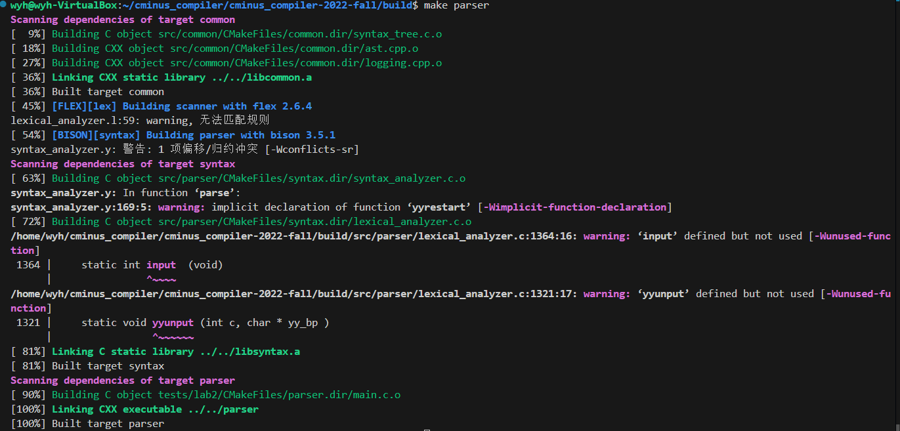
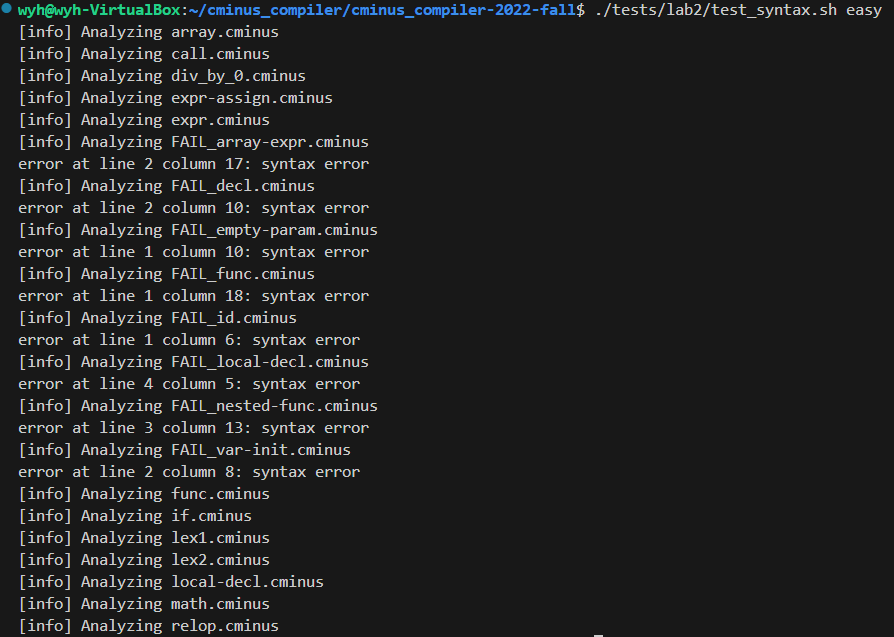
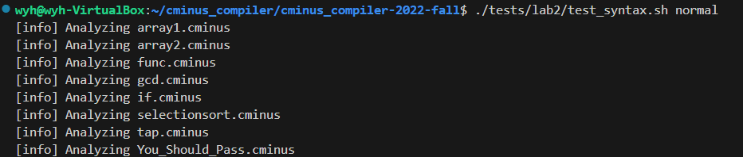
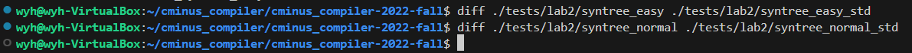
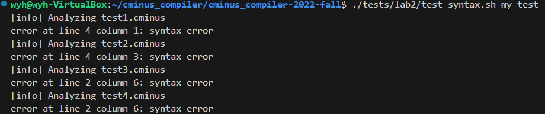

# lab2 实验报告
学号：202308010412  
姓名：王宇航
## 实验要求

### 主要工作

1. 了解 `bison` 基础知识和理解 Cminus-f 语法（重在了解如何将文法产生式转换为 `bison` 语句）
2. 阅读 `/src/common/SyntaxTree.c`，对应头文件 `/include/SyntaxTree.h`（重在理解分析树如何生成）
3. 了解 `bison` 与 `flex` 之间是如何协同工作，看懂pass_node函数并改写 Lab1 代码（提示：了解 `yylval` 是如何工作，在代码层面上如何将值传给`$1`、`$2`等）
4. 补全 `src/parser/syntax_analyzer.y` 文件和 `lexical_analyzer.l` 文件

Tips：在未编译的代码文件中是无法看到关于协同工作部分的代码，建议先编译 1.3 给出的计算器样例代码，再阅读 `/build/src/parser/` 中的 `syntax_analyzer.h` 与 `syntax_analyzer.c` 文件

### 思考题

本部分不算做实验分，出题的本意在于想要帮助同学们加深对实验细节的理解，欢迎有兴趣和余力的同学在报告中写下你的思考答案，或者在issue中分享出你的看法。

1. 在1.3样例代码中存在左递归文法，为什么 `bison` 可以处理？（提示：不用研究`bison`内部运作机制，在下面知识介绍中有提到 `bison` 的一种属性，请结合课内知识思考）
```bash
在 LALR(1) 文法中，直接左递归可以通过以下方式处理：

在语法分析表构建时，LALR(1) 算法能够将左递归规则转换为等价的右递归形式（在分析表中体现为归约动作）。

Bison 会在内部将左递归规则转换为循环归约的过程，而不需要显式改写文法。

关键点：对于 LALR(1) 文法，直接左递归不会引起冲突，只要相应的产生式能够通过向前看一个符号区分。
```

2. 请在代码层面上简述下 `yylval` 是怎么完成协同工作的。（提示：无需研究原理，只分析维护了什么数据结构，该数据结构是怎么和`$1`、`$2`等联系起来？）
```bash
一、yylval 的数据结构本质
yylval 是一个在词法分析器（Flex）和语法分析器（Bison）之间共享的全局变量。

它的类型是一个联合体（union），能够在一个单一变量内存储多种不同类型的数据（如整型、浮点型、字符串、结构体指针等）。

这个联合体结构的具体成员通常在 Bison 语法文件中通过 %union 指令定义，并由 Bison 自动生成到相关的头文件中。

二、数据传递与协同工作流程
赋值阶段（词法分析器）：当 Flex 识别出一个词法单元（token）时，它会将这个词法单元的语义值（例如，识别出的数字的数值、标识符的名称字符串）存储到 yylval 联合体的对应字段中。

传递阶段：Flex 在 return 一个 token 类型代码给 Bison 的同时，yylval 中已存储的语义值也随之完成传递。

接收与压栈阶段（语法分析器）：Bison 接收到 token 后，会自动将此刻 yylval 中的值压入其内部维护的一个独立栈中，这个栈称为“值栈”。

三、$n 与内部数据结构的关联机制
Bison 在运行时维护两个核心的并行栈：语法分析栈（记录语法符号的状态序列）和语义值栈（即值栈，记录每个语法符号对应的语义值）。

当进行语法规约时，Bison 根据产生式规则右部符号的位置，自动将值栈中对应位置的语义值映射给位置符号 $1， $2 等。

$1 获取值栈中与规则右部第一个符号相对应的语义值。

$2 获取值栈中与规则右部第二个符号相对应的语义值，以此类推。

$$ 代表规则左部非终结符的语义值。在规约动作中，对 $$ 进行赋值，其结果将在规约完成后，被 Bison 自动存储回值栈的相应位置，以供上层规则使用。

类型安全保证：通过 Bison 文件中的 %token <类型> 和 %type <类型> 声明，Bison 能够知道每个语法符号应该对应 yylval 联合体中的哪个字段，从而确保 $n 和 $$ 在访问语义值时类型正确，避免了直接的联合体字段访问错误。
```
3. 请尝试使用1.3样例代码运行除法运算除数为0的例子（测试case中有）看下是否可以通过，如果不，为什么我们在case中把该例子认为是合法的？（请从语法与语义上简单思考）  
```bash
可以通过；语法分析器认为除数为0是合法的，因为“2/0”可以由上面规定的文法推导出来，所以从语法上来说它是合法的，由于语法分析使用的是上下文无关文法，所以它不能判断语义是否合法；
```

4. 能否尝试修改下1.3计算器文法，使得它支持除数0规避功能。
```bash
词法分析器在读到非终结符NUMBER时，先判断yytext获取到的值是否为0，不为0才将它的语义值压入到yylval.num中，否则不将其传到语法分析器中：

修改之后，若除数为0，则直接报错，支持除数0规避功能：

```

### 详细要求

本次实验需要各位同学首先将自己的 lab1 的词法部分复制到 `/src/parser` 目录的 [lexical\_analyzer.l](../../src/parser/lexical\_analyzer.l)并合理修改相应部分，然后根据 `cminus-f` 的语法补全 [syntax\_analyer.y](../../src/parser/syntax_analyzer.y) 文件，完成语法分析器，要求最终能够输出解析树。如：

输入：

```c
int bar;
float foo(void) { return 1.0; }
```

则 `parser` 将输出如下解析树：

```
>--+ program
|  >--+ declaration-list
|  |  >--+ declaration-list
|  |  |  >--+ declaration
|  |  |  |  >--+ var-declaration
|  |  |  |  |  >--+ type-specifier
|  |  |  |  |  |  >--* int
|  |  |  |  |  >--* bar
|  |  |  |  |  >--* ;
|  |  >--+ declaration
|  |  |  >--+ fun-declaration
|  |  |  |  >--+ type-specifier
|  |  |  |  |  >--* float
|  |  |  |  >--* foo
|  |  |  |  >--* (
|  |  |  |  >--+ params
|  |  |  |  |  >--* void
|  |  |  |  >--* )
|  |  |  |  >--+ compound-stmt
|  |  |  |  |  >--* {
|  |  |  |  |  >--+ local-declarations
|  |  |  |  |  |  >--* epsilon
|  |  |  |  |  >--+ statement-list
|  |  |  |  |  |  >--+ statement-list
|  |  |  |  |  |  |  >--* epsilon
|  |  |  |  |  |  >--+ statement
|  |  |  |  |  |  |  >--+ return-stmt
|  |  |  |  |  |  |  |  >--* return
|  |  |  |  |  |  |  |  >--+ expression
|  |  |  |  |  |  |  |  |  >--+ simple-expression
|  |  |  |  |  |  |  |  |  |  >--+ additive-expression
|  |  |  |  |  |  |  |  |  |  |  >--+ term
|  |  |  |  |  |  |  |  |  |  |  |  >--+ factor
|  |  |  |  |  |  |  |  |  |  |  |  |  >--+ float
|  |  |  |  |  |  |  |  |  |  |  |  |  |  >--* 1.0
|  |  |  |  |  |  |  |  >--* ;
|  |  |  |  |  >--* }
```

请注意，上述解析树含有每个解析规则的所有子成分，包括诸如 `;` `{` `}` 这样的符号，请在编写规则时务必不要忘了它们。

### 2.1 目录结构

```shell
.
├── CMakeLists.txt
├── Documentations
│   ├── lab1
│   └── lab2
│       ├── readings.md        <- 扩展阅读
│       └── README.md          <- lab2实验文档说明（你在这里）
├── README.md
├── Reports
│   ├── lab1
│   └── lab2
│       └── report.md          <- lab2所需提交的实验报告（你需要在此提交实验报告）
├── include                     <- 实验所需的头文件
│   ├── lexical_analyzer.h
│   └── SyntaxTree.h
├── src                         <- 源代码
│   ├── common
│   │   └── SyntaxTree.c      <- 分析树相关代码
│   ├── lexer
│   └── parser
│       ├── lexical_analyzer.l <- lab1 的词法部分复制到这，并进行一定改写
│       └── syntax_analyzer.y  <- lab2 需要完善的文件
└── tests                      <- 测试文件
    ├── lab1
    └── lab2                   <- lab2 测试用例文件夹
```
## 实验难点
**1. Bison文件的编写**

Bison是一个语法分析器的生成工具， 可以将 LALR 文法转换成可编译的 C 代码，文件扩展名为 .y。在Bison文件中给出LALR文法以及一些分析动作，编译就可以产生一个语法分析器。  

每个 Bison 文件由 %% 分成三部分（以我们要补全的syntax_analyzer.y为例）。

* <mark> bison 指令</mark>  
union: 在语法分析过程中，语法分析树的叶子节点是一个具体的语义值，该值的类型是YYSTYPE，在Bison中用%union指明。

  * 不同的节点对应着不同的终结符，可能为不同的类型，因此union中可以包含不同的数据类型。比如，我们可能希望 ADDOP 的值是 char 类型，而 NUMBER 应该是 double 类型的。
  * 用 %start 指令指定起始符号，用 %token 定义一个 
  token
  ```c
  %{
    /* 这里是序曲 */
    /* 这部分代码会被原样拷贝到生成的 .c 文件的开头 */
    #include <stdio.h>
    #include <stdlib.h>
    #include <string.h>
    #include <stdarg.h>
    #include "syntax_tree.h"
    ​
    // external functions from lex
    //提供一个 yylex 来获取下一个 token
    extern int yylex();
    ​
    // external variables from lexical_analyzer module
    extern int lines;
    extern char *yytext;
    extern int pos_end;
    extern int pos_start;
    ​
    // Global syntax tree
    syntax_tree *gt;
    ​
    // Error reporting
    //提供一个 yyerror 来提供合适的报错机制。
    void yyerror(const char *s);
    ​
    // Helper functions written for you with love
    syntax_tree_node *node(const char *node_name, int children_num, ...);
    %}
    ​
    ​
    /* 这些地方可以输入一些 bison 指令 */
    /* TODO: Complete this definition. */
    /*在 bison 解析过程中，每个 symbol 最终都对应到一个语义值上。或者说，在 parse tree 上，每个节点都对应一个语义值，这个值的类型是 YYSTYPE。YYSTYPE 的具体内容是由 %union 构造指出的。
    */
    %union {}
    ​
    /* TODO: Your tokens here. */
    /* 比如用 %start 指令指定起始符号，用 %token 定义一个 token */
    %start program
    %token <num> NUMBER     /*声明词法单元名，同时在<>中指明类型*/
    %type  <typex> expr     /*指明类型*/
  ```
* <mark> 辅助函数</mark>  
    ```c
    /* 这里是尾声 */
    /* 这部分代码会被原样拷贝到生成的 .c 文件的末尾 */
    /// The error reporting function.
    void yyerror(const char *s)
    {
        // TO STUDENTS: This is just an example.
        // You can customize it as you like.
        fprintf(stderr, "error at line %d column %d: %s\n", lines, pos_start, s);
    }
    ​
    /// Parse input from file `input_path`, and prints the parsing results
    /// to stdout.  If input_path is NULL, read from stdin.
    ///
    /// This function initializes essential states before running yyparse().
    syntax_tree *parse(const char *input_path)
    {
        if (input_path != NULL) {
            if (!(yyin = fopen(input_path, "r"))) {
                fprintf(stderr, "[ERR] Open input file %s failed.\n", input_path);
                exit(1);
            }
        } else {
            yyin = stdin;
        }
    ​
        lines = pos_start = pos_end = 1;
        gt = new_syntax_tree();
        yyrestart(yyin);
        yyparse();
        return gt;
    }
    ​
    /// A helper function to quickly construct a tree node.
    ///
    /// e.g.
    ///     $$ = node("program", 1, $1);
    ///     $$ = node("local-declarations", 0);
    syntax_tree_node *node(const char *name, int children_num, ...)
    {
        syntax_tree_node *p = new_syntax_tree_node(name);
        syntax_tree_node *child;
        if (children_num == 0) {
            child = new_syntax_tree_node("epsilon");
            syntax_tree_add_child(p, child);
        } else {
            va_list ap;
            va_start(ap, children_num);
            for (int i = 0; i < children_num; ++i) {
                child = va_arg(ap, syntax_tree_node *);
                syntax_tree_add_child(p, child);
            }
            va_end(ap);
        }
        return p;
    }
    ```
**2.修改lexical_analyzer.l**  

每个终结符都对应着一个叶子节点，这个叶子节点在词法分析时就可以产生。在自底向上的分析过程中，首先产生的是叶子节点，在用产生式进行归约时向上构建语法分析树。

叶子节点的产生在词法分析器中的pass_node()函数中实现，创建一个新的节点，并将其指针赋值给yylval，节点名为其成分(非终结符名或终结符名)，这样语法分析器就可以使用该节点构造语法分析树。
```c
//生成节点并存入yylval传递给语法分析器
void pass_node(char *text){
     yylval.node = new_syntax_tree_node(text);
}
//识别词法单元时调用pass_node
\+  { pos_start = pos_end; pos_end += 1; pass_node(yytext); return ADD; }
```
```
注意，在这里，我并没有发现yyval的声明，就被使用了。查阅资料，发现：

在典型的 Lex 文件中，yylval 被认为是由 Bison 生成的 C 代码提供的，而不是由 Lex 文件显式声明的。在 Bison 的头文件中，YYSTYPE 的定义和 %union 部分中的定义是一致的，从而确保 yylval 被正确声明。

在 Bison 的生成代码中，yylval 通常是通过 $$ 来访问的。
```
**3. 分析树如何生成**  

查看/include/SyntaxTree.h，

分析树的节点记录了父节点，子节点的指针，以及子节点数和节点名信息。 相关的方法包括生成新的节点，添加子节点，创建语法树等。
```c
//语法分析树的节点
struct _syntax_tree_node {
    struct _syntax_tree_node * parent;
    struct _syntax_tree_node * children[10];
    int children_num;
​
    char name[SYNTAX_TREE_NODE_NAME_MAX];
};
typedef struct _syntax_tree_node syntax_tree_node;
​
//相关函数
syntax_tree_node * new_anon_syntax_tree_node();                                 //创建新节点
syntax_tree_node * new_syntax_tree_node(const char * name);                     
int syntax_tree_add_child(syntax_tree_node * parent, syntax_tree_node * child); //添加子节点
void del_syntax_tree_node(syntax_tree_node * node, int recursive);              //删除节点
syntax_tree* new_syntax_tree();                                                 //创建语法分析树
void del_syntax_tree(syntax_tree * tree);                                       //删除分析树
void print_syntax_tree(FILE * fout, syntax_tree * tree);                        //输出分析树
```

`词法分析`完成了叶子节点的产生，剩下的工作就由语法分析来完成了。构建的过程就是在每使用一个产生式进行规约时，建立一个新的节点表示当前产生式的非终结符，然后将产生式中的成分，也就是子节点的指针存入这个新节点中。

当最后使用初始产生式规约时，产生的新节点就是语法分析树的根节点，就完成了向上构建语法分析树的工作。

## 实验设计

### 1.补充lexical_analyzer.l  

观察到pass_node函数，flex将数值存入yylval，而bison读取yylval之中的值，所以对于每个token，我们都应该创建其的结点。
```cpp
void pass_node(char *text){
     yylval.node = new_syntax_tree_node(text);
}

```

接着修改lab1中的`lexical_analyzer.l`补充到lab2中的`lexical_analyzer.l`，lab1中正则定义即token保持不变。但对于每个token匹配时对应的动作进行修改，都添加一个`pass_node(yytext)`。

因为语法分析树不考虑注释COMMENT，换行EOL以及空格BLANK，所以不用建立结点不进行返回，只需要把`pos_end，pos_start`进行修改即可。对于其他未定义的字符只需要`printf(“error\n”)`。同时lab1中的void analyzer函数也不需要。
按照如下样例进行修改：
```c
\+  { pos_start = pos_end; pos_end += 1; pass_node(yytext); return ADD; }
\- { pos_start = pos_end;pos_end++; pass_node(yytext); return SUB;}
\* { pos_start = pos_end;pos_end++; pass_node(yytext); return MUL;}
\/ { pos_start = pos_end;pos_end++; pass_node(yytext); return DIV;}
\< { pos_start = pos_end;pos_end++; pass_node(yytext); return LT;}
\<\= { pos_start = pos_end;pos_end += 2; pass_node(yytext); return LTE;}
\> { pos_start = pos_end;pos_end++; pass_node(yytext); return GT;}
\>\= { pos_start = pos_end;pos_end += 2; pass_node(yytext); return GTE;}
\=\= { pos_start = pos_end;pos_end += 2; pass_node(yytext); return EQ;}
\!\= { pos_start = pos_end;pos_end += 2; pass_node(yytext); return NEQ;}
\= { pos_start = pos_end;pos_end++; pass_node(yytext); return ASSIN;}

\; { pos_start = pos_end;pos_end++; pass_node(yytext); return SEMICOLON;}
\, { pos_start = pos_end;pos_end++; pass_node(yytext); return COMMA;}
\( { pos_start = pos_end;pos_end++; pass_node(yytext); return LPARENTHESE;}
\) { pos_start = pos_end;pos_end++; pass_node(yytext); return RPARENTHESE;}
\[ { pos_start = pos_end;pos_end++; pass_node(yytext); return LBRACKET;}
\] { pos_start = pos_end;pos_end++; pass_node(yytext); return RBRACKET;}
\{ { pos_start = pos_end;pos_end++; pass_node(yytext); return LBRACE;}
\} { pos_start = pos_end;pos_end++; pass_node(yytext); return RBRACE;}

else { pos_start = pos_end;pos_end += 4; pass_node(yytext); return ELSE;}
if { pos_start = pos_end;pos_end += 2; pass_node(yytext); return IF;}
int { pos_start = pos_end;pos_end += 3; pass_node(yytext); return INT;}
float { pos_start = pos_end;pos_end += 5; pass_node(yytext); return FLOAT;}
return { pos_start = pos_end;pos_end += 6; pass_node(yytext); return RETURN;}
void { pos_start = pos_end;pos_end += 4; pass_node(yytext); return VOID;}
while { pos_start = pos_end;pos_end += 5; pass_node(yytext); return WHILE;}

[a-zA-Z]+ { pos_start = pos_end;pos_end += strlen(yytext); pass_node(yytext); return IDENTIFIER;}
[0-9]+ { pos_start = pos_end;pos_end += strlen(yytext); pass_node(yytext); return INTEGER;}
[0-9]+\.|[0-9]*\.[0-9]+ { pos_start = pos_end;pos_end += strlen(yytext); pass_node(yytext); return FLOATPOINT;}
\[\] { pos_start = pos_end;pos_end += 2; pass_node(yytext); return ARRAY;}

[\n]+ {pos_start = 1;pos_end = 1;lines+=strlen(yytext);}
\/\*([^\*]|(\*)*[^\*\/])*(\*)*\*\/ {
          for(int i=0;i<strlen(yytext);i++){
		if(yytext[i]=='\n'){
			pos_start=1;
			pos_end=1;
			lines++;
		}
		else pos_end++;
}
}
[ \f\n\r\t\v] {pos_start = pos_end;pos_end+=strlen(yytext);}
. {return 0;}

```

**至此，lexical_analyzer.l 文件修改完毕**

### 2.补充syntax_analyzer.y

`syntax_analyzer.y` 给出了一个参考样例：

```c
%start program
program : declaration-list { $$ = node("program", 1, $1); gt->root = $$; }
```
实验文档提到program是起始符号，node的函数原型是`syntax_tree_node *node(const char *node_name, int children_num, ...)`; ，说明program节点的类型为 `syntax_tree_node*` 。

同时实验文档给出$$符号代表当前节点，已解析的节点则是从左到右依次编号，称作$1, $2, $3… 。

`$$ = node("program", 1, $1)` 语句表示为当前识别到的 program 创建一个结点，并将结点赋给 program，作为识别到的语法单元 program 在语法分析树中的结点。结点名字为"program"

`program : declaration-list` 表示program具备一个子结点，子结点为 declaration-list

`gt->root = $$`，将 当前节点（program）作为根节点，使其作为语法分析树的起始。

因此可以看出，对于语法的分析结构应该为如下的形式：
```c
parent : son				{ $$ = node("parent", 1, $1);}
    | daughter			{ $$ = node("parent", 1, $1);}
    | son AND daughter	{ $$ = node("parent", 3, $1, $2, $3);}
```
其中 parent、son、daughter 都是 `syntax_tree_node*` 类型，都为非终结符；AND 也是 `syntax_tree_node*` 类型，为终结符。

**（1）补充%union**

实验文档提到在 bison 解析过程中，每个 symbol 最终都对应到一个语义值上。或者说，在 parse tree 上，每个节点都对应一个语义值，这个值的类型是 YYSTYPE。YYSTYPE 的具体内容是由 %union 构造指出的。不管是%token（终结符）还是%token（非终结符），都应该是syntax_tree_node * node类型，这样才能构建解析树。
```c
%union {
	syntax_tree_node * node;
}
```
**（2）补充%token和%type**

实验文档给出了%token和%type具体用法。%token的符号是大写，代表终结符，对应词法分析，而%type的符号是小写，代表非终结符，结合词法分析中 lexical_analyzer.l 中提供的 token （终结符）

```bash
ADD SUB MUL DIV LT LTE GT GTE EQ NEQ ASSIN
SEMICOLON COMMA LPARENTHESE RPARENTHESE LBRACKET RBRACKET
LBRACE RBRACE ELSE IF INT FLOAT RETURN VOID WHILE
IDENTIFIER INTEGER FLOATPOINT ARRAY LETTER
```
补充后的结果如下：
```bash
%token <node> ADD SUB MUL DIV LT LTE GT GTE EQ NEQ ASSIN
 			 SEMICOLON COMMA LPARENTHESE RPARENTHESE LBRACKET RBRACKET
			 LBRACE RBRACE ELSE IF INT FLOAT RETURN VOID WHILE
			 IDENTIFIER INTEGER FLOATPOINT ARRAY LETTER

%type <node> program declaration-list declaration var-declaration
             type-specifier fun-declaration params param-list param
             compound-stmt local-declarations statement-list
             statement expression-stmt selection-stmt iteration-stmt
             return-stmt expression var simple-expression relop
             additive-expression addop term mulop factor integer float call
             args arg-list
```
**（3） 根据实验中所给的Cminus-f语法，补充每个%type的文法解析。**

基本结构为：前面写出产生式左部，在：后面写出产生式右部，然后再在{}里面进行赋值定义，node的第一个参数为产生式左部名称，第二个参数代表有多少个子节点，然后再在后面的参数分别标上序号。需要注意的是，当解析为空时，node函数所传参数为(name,0)，name对应字符串，而0表示孩子为空。 需要补充的文法解析详细内容在上一步已经给出，下面是补充完的结果
```c
program : declaration-list { $$ = node("program", 1, $1); gt->root = $$; }

declaration-list : declaration-list declaration { $$ = node("declaration-list", 2, $1, $2);}
                 | declaration { $$ = node("declaration-list", 1, $1); }

declaration : var-declaration { $$ = node("declaration", 1, $1); }
            | fun-declaration { $$ = node("declaration", 1, $1); }

var-declaration : type-specifier IDENTIFIER SEMICOLON { $$ = node("var-declaration", 3, $1, $2, $3); }
                | type-specifier IDENTIFIER LBRACKET INTEGER RBRACKET SEMICOLON { $$ = node("var-declaration", 6, $1, $2, $3, $4, $5, $6); }

type-specifier : INT { $$ = node("type-specifier", 1, $1); }
               | FLOAT { $$ = node("type-specifier", 1, $1); }
               | VOID { $$ = node("type-specifier", 1, $1); }

fun-declaration : type-specifier IDENTIFIER LPARENTHESE params RPARENTHESE compound-stmt { $$ = node("fun-declaration", 6, $1, $2, $3, $4, $5, $6); }

params : param-list { $$ = node("params", 1, $1); }
       | VOID { $$ = node("params", 1, $1); }

param-list : param-list COMMA param { $$ = node("param-list", 3, $1, $2, $3); }
           | param { $$ = node("param-list", 1, $1); }

param : type-specifier IDENTIFIER { $$ = node("param", 2, $1, $2); }
      | type-specifier IDENTIFIER ARRAY { $$ = node("param", 3, $1, $2, $3); }

compound-stmt : LBRACE local-declarations statement-list RBRACE { $$ = node("compound-stmt", 4, $1, $2, $3, $4); }

local-declarations : { $$ = node("local-declarations", 0); }
                   | local-declarations var-declaration { $$ = node("local-declarations", 2, $1, $2); }

statement-list : { $$ = node("statement-list", 0); }
               | statement-list statement { $$ = node("statement-list", 2, $1, $2); }

statement : expression-stmt { $$ = node("statement", 1, $1); }
          | compound-stmt { $$ = node("statement", 1, $1); }
          | selection-stmt { $$ = node("statement", 1, $1); }
          | iteration-stmt { $$ = node("statement", 1, $1); }
          | return-stmt { $$ = node("statement", 1, $1); }

expression-stmt : expression SEMICOLON { $$ = node("expression-stmt", 2, $1, $2); }
                | SEMICOLON { $$ = node("expression-stmt", 1, $1); }

selection-stmt : IF LPARENTHESE expression RPARENTHESE statement { $$ = node("selection-stmt", 5, $1, $2, $3, $4, $5); }
               | IF LPARENTHESE expression RPARENTHESE statement ELSE statement { $$ = node("selection-stmt", 7, $1, $2, $3, $4, $5, $6, $7); }

iteration-stmt : WHILE LPARENTHESE expression RPARENTHESE statement { $$ = node("iteration-stmt", 5, $1, $2, $3, $4, $5); }

return-stmt : RETURN SEMICOLON { $$ = node("return-stmt", 2, $1, $2); }
            | RETURN expression SEMICOLON { $$ = node("return-stmt", 3, $1, $2, $3); }

expression : var ASSIN expression { $$ = node("expression", 3, $1, $2, $3); }
           | simple-expression { $$ = node("expression", 1, $1); }

var : IDENTIFIER { $$ = node("var", 1, $1); }
    | IDENTIFIER LBRACKET expression RBRACKET { $$ = node("var", 4, $1, $2, $3, $4); }

simple-expression : additive-expression relop additive-expression { $$ = node("simple-expression", 3, $1, $2, $3); }
                  | additive-expression { $$ = node("simple-expression", 1, $1); }

relop : LTE { $$ = node("relop", 1, $1); }
      | LT { $$ = node("relop", 1, $1); }
      | GT { $$ = node("relop", 1, $1); }
      | GTE { $$ = node("relop", 1, $1); }
      | EQ { $$ = node("relop", 1, $1); }
      | NEQ { $$ = node("relop", 1, $1); }

additive-expression : additive-expression addop term { $$ = node("additive-expression", 3, $1, $2, $3); }
                    | term { $$ = node("additive-expression", 1, $1); }

addop : ADD { $$ = node("addop", 1, $1); }
      | SUB { $$ = node("addop", 1, $1); }

term : term mulop factor { $$ = node("term", 3, $1, $2, $3); }
     | factor { $$ = node("term", 1, $1); }

mulop : MUL { $$ = node("mulop", 1, $1); }
      | DIV { $$ = node("mulop", 1, $1); }

factor : LPARENTHESE expression RPARENTHESE { $$ = node("factor", 3, $1, $2, $3); }
       | var { $$ = node("factor", 1, $1); }
       | call { $$ = node("factor", 1, $1); }
       | integer { $$ = node("factor", 1, $1); }
       | float { $$ = node("factor", 1, $1); }

integer : INTEGER { $$ = node("integer", 1, $1); }

float : FLOATPOINT { $$ = node("float", 1, $1); }

call : IDENTIFIER LPARENTHESE args RPARENTHESE { $$ = node("call", 4, $1, $2, $3, $4); }

args : { $$ = node("args", 0); }
     | arg-list { $$ = node("args", 1, $1); }

arg-list : arg-list COMMA expression { $$ = node("arg-list", 3, $1, $2, $3); }
         | expression { $$ = node("arg-list", 1, $1); }


```

## 实验结果验证

**1. 首先进行make操作，使用如下命令**
```bash
make parser
```
若无问题，将出现如下结果



**2.运行测试**

(1)验证easy
```bash
./tests/lab2/test_syntax.sh easy
```


(2)验证normal
```bash
./tests/lab2/test_syntax.sh normal
```


(3)diff对比
```bash
diff ./tests/lab2/syntree_easy ./tests/lab2/syntree_easy_std
diff ./tests/lab2/syntree_normal ./tests/lab2/syntree_normal_std
```


**3.个人案例测试1（主要测试文法漏洞）**

* 变量声明和赋值
```c
void fun(void){
int n;
n=1;
int c;
}
```

* 变量++和--
```c
void fun(void){
int n;
n=1;
n++;
n--;
}
```

* 变量类型
```c
void fun(void){
long n;
}
```

* 函数参数
```c
void fun(){
int n;
}
```

测试结果如下：



测试结果表明该文法存在以下问题：
* 变量不能分多次定义，只允许一次性定义完全
* 变量不允许进行自++和--
* 变量类型不全（比如long型没有）
* 函数参数不允许为空
* 
**4.个人案例测试1（主要测试正确代码）**
```c
int fun(int n){
	return n*2;
}

int main(void) {
	int a;
	int b;
	float c;
	a=1+2*3;
	b=(1+2)*3;
	if(2>1){
		a=a+1;
	}
	else b=b+1;
	while(a>1){
		a=a-1;
	}
	return fun(b);
}
```
结果如下(截取部分)

```bash
>--+ program
|  >--+ declaration-list
|  |  >--+ declaration-list
|  |  |  >--+ declaration
|  |  |  |  >--+ fun-declaration
|  |  |  |  |  >--+ type-specifier
|  |  |  |  |  |  >--* int
|  |  |  |  |  >--* fun
|  |  |  |  |  >--* (
|  |  |  |  |  >--+ params
|  |  |  |  |  |  >--+ param-list
|  |  |  |  |  |  |  >--+ param
|  |  |  |  |  |  |  |  >--+ type-specifier
|  |  |  |  |  |  |  |  |  >--* int
|  |  |  |  |  |  |  |  >--* n
|  |  |  |  |  >--* )
|  |  |  |  |  >--+ compound-stmt
|  |  |  |  |  |  >--* {
|  |  |  |  |  |  >--+ local-declarations
|  |  |  |  |  |  |  >--* epsilon
|  |  |  |  |  |  >--+ statement-list
|  |  |  |  |  |  |  >--+ statement-list
|  |  |  |  |  |  |  |  >--* epsilon
|  |  |  |  |  |  |  >--+ statement
|  |  |  |  |  |  |  |  >--+ return-stmt
|  |  |  |  |  |  |  |  |  >--* return
|  |  |  |  |  |  |  |  |  >--+ expression
|  |  |  |  |  |  |  |  |  |  >--+ simple-expression
|  |  |  |  |  |  |  |  |  |  |  >--+ additive-expression
|  |  |  |  |  |  |  |  |  |  |  |  >--+ term
|  |  |  |  |  |  |  |  |  |  |  |  |  >--+ term
|  |  |  |  |  |  |  |  |  |  |  |  |  |  >--+ factor
|  |  |  |  |  |  |  |  |  |  |  |  |  |  |  >--+ var
|  |  |  |  |  |  |  |  |  |  |  |  |  |  |  |  >--* n
|  |  |  |  |  |  |  |  |  |  |  |  |  >--+ mulop
|  |  |  |  |  |  |  |  |  |  |  |  |  |  >--* *
|  |  |  |  |  |  |  |  |  |  |  |  |  >--+ factor
|  |  |  |  |  |  |  |  |  |  |  |  |  |  >--+ integer
|  |  |  |  |  |  |  |  |  |  |  |  |  |  |  >--* 2
|  |  |  |  |  |  |  |  |  >--* ;
|  |  |  |  |  |  >--* }

```


## 实验反馈
在修改 lexical_analyzer.l 的部分，可以直接根据实验文档给的例子模仿补充，且也给出了pass_node函数的原型，使得修改自 Lab1 中 copy 的词法部分变得简单了许多。只不过需要考虑一些特殊的，例如 EOL、COMMENT、BLANK。一开始，对于这些 others，我是直接删去的。但后来在验证的时候，发现如果删去，则无法识别空格、换行符等无关信息，也无法识别注释等内容。这些内容会原封不动地进行输出，而导致输出结果错误（前面空了一大堆，或是存在注释）。随后，我把这些 others 加了回去，且考虑到这些只需要识别，而不需要做语法分析（在语法分析树中不占用内容），故直接去除 return 即可。

比较困难的地方在于补充syntax_analyzer.y 。首先实验文档只给出了文法，却没给出其具体含义。所以只能先按照样例补充完整，然后通过测试来求出各个文法的含义。

补充syntax_analyzer.y是比较困难的部分，代码量也比较大。但通过查阅资料，也基本了解了各个产生式及其动作，对于语法分析、语法制导翻译、语义分析，有了更深的了解

通过实现一个cminus-f语法分析器，我大致了解了bison的分析过程：
调用函数yyparse开始进行分析；
用词法分析器读取记号：yylex从输入流中识别记号并将记号类型的正值数字码（数字码用来确定需要解析的token类型）返回给语法分析器（数字码在bison编译.y文件时生成的.h文件里），并将这些记号和它们的语义值压入栈中（移进）；
当最后n个被移进的记号和组匹配某个语法规则时, 可以由那个规则将它们结合起来（归约），这些记号被规则的左部取代。动作是处理归约的一部分, 因为动作会计算这个组的语意值；
当yyparse遇到输入结束或者不能恢复的错误就会返回；

